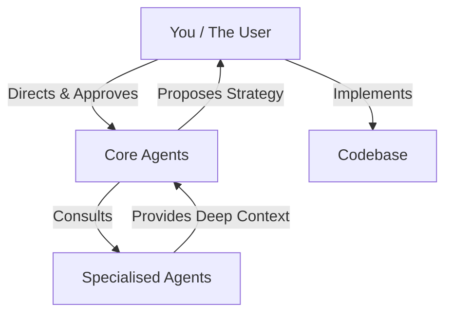
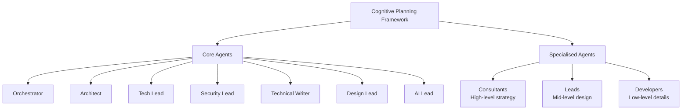
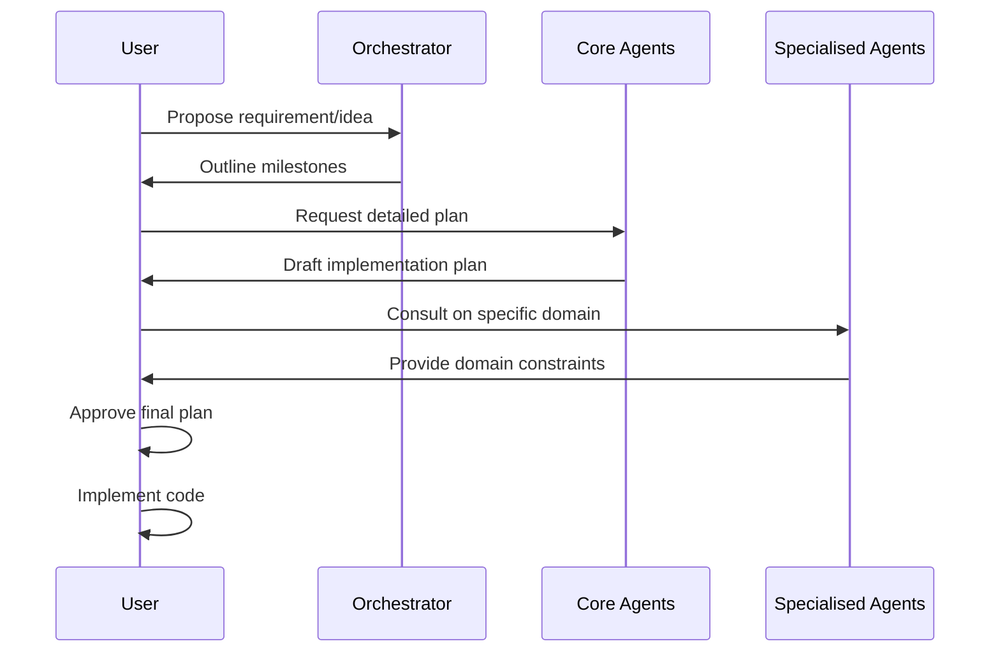
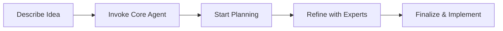
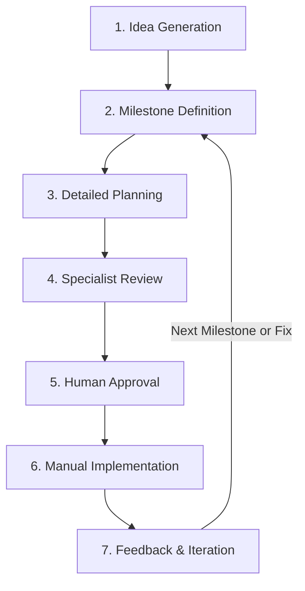
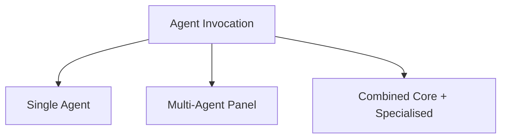
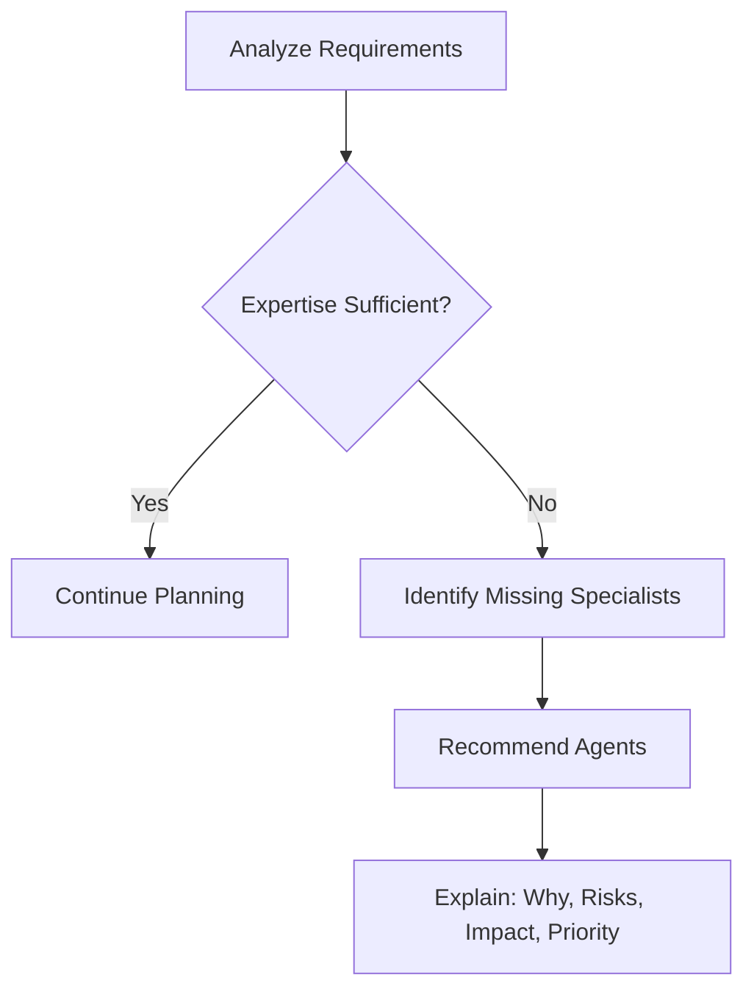
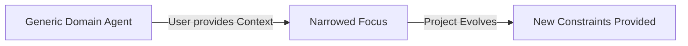
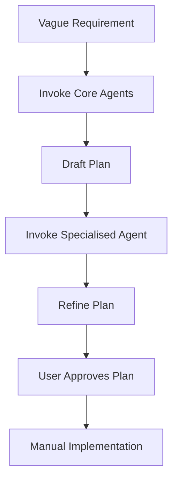

# Cognitive Planning Framework

A modular AI "virtual technical organization" for planning and decision support.

## 1. Project Overview

The Cognitive Planning Framework is a methodology and collection of structured AI personas (agents) designed to help you plan, architect, and design software projects. Rather than automating code execution, this framework provides a suite of virtual experts that analyze requirements, propose solutions, identify risks, and help you create robust technical plans before you write a single line of code. It solves the "blank page" problem by giving you a team of specialized advisors to consult with at every stage of the software development lifecycle.

This system is built entirely on the philosophy of **planning, not automation**, keeping you (the human) firmly in the loop as the final decision-maker and implementer.

**Key Capabilities:**
*   Provides architectural and technical guidance for complex problems.
*   Identifies potential security, design, and implementation risks early.
*   Helps structure project milestones and detailed implementation plans.
*   Adapts to any technology stack or project domain.

---

## 2. Core Concept: Your Virtual Technical Organization



Think of this framework as your personal, on-demand engineering department.

*   **Core Agents** act as your leadership team. They are the general thinkers, architects, and leads who guide the overall strategy of the project.
*   **Specialised Agents** are your domain experts or "lenses." They provide deep, specific knowledge on particular topics (like database performance or accessibility) when the core team needs it.
*   **You (The User)** are the final authority and the implementer. You direct the agents, evaluate their proposals, make decisions, and ultimately execute the code.

The agents in this framework **do not write or execute code in your repository**. They produce analysis, technical specifications, and actionable plans (proposals) for you to implement.

---

## 3. Agent Hierarchy



The framework organizes agents into two primary categories based on their role and authority level.

### Core Agents

Core Agents are always available to provide broad, strategic reasoning. They live at the root of the repository.

*   **Orchestrator (`/orchestrator.md`):** The primary decision integrator and project manager. Helps break down ideas and coordinate the team.
*   **Architect (`/architect.md`):** Focuses on system design, scalability, and high-level technical choices.
*   **Tech Lead (`/tech-lead.md`):** Translates architecture into practical, developer-friendly implementation plans.
*   **Security Lead (`/security-lead.md`):** Identifies vulnerabilities and ensures security best practices are baked in from the start.
*   **Technical Writer (`/technical-writer.md`):** Helps structure documentation, user guides, and API specs.
*   **Design Lead (`/design-lead.md`):** Focuses on user experience, interface design, and usability constraints.
*   **AI Lead (`/ai-lead.md`):** Advises on integrating AI capabilities and managing AI-specific risks.

### Specialised Agents

Specialised Agents are domain-agnostic base personas that act as context-adaptive expert lenses. They are loaded only when their specific perspective is needed and are strictly advisory. Their specialization emerges dynamically from the context of your conversation and project, rather than being hardcoded variants.

They are organized by classification level:
*   `/team/consultants/`: High-level domain advisors providing strategy and risk assessment.
*   `/team/leads/`: Mid-level specialists providing design guidance and architecture reviews.
*   `/team/developers/`: Detailed implementers providing practical, low-level guidance.

---

## 4. How Core Agents and Specialised Agents Work Together



The true power of the framework comes from collaboration:

1.  **Core agents reason broadly** about the project's overall needs.
2.  **Specialised agents constrain the domain**, providing specific guardrails and expert insights when complex technical challenges arise.
3.  **Multiple agents can be active simultaneously** in a single conversation.
4.  **The Orchestrator (if used) synthesizes** the various outputs into a cohesive plan.
5.  **The Orchestrator can assess team capability.**
    Based on requirements, it may recommend additional specialised agents that should be consulted. These recommendations are advisory and help identify missing expertise before detailed planning continues.

**Example Interaction Model:**
*   *You* ask the Orchestrator to plan a new user authentication feature.
*   *Orchestrator* outlines the milestones.
*   *You* bring in the *Security Lead* to review the plan.
*   *Security Lead* flags a potential session management risk.
*   *You* bring in a *Database Lead* (Specialised Agent) to propose a secure schema for session storage.
*   *You* approve the final plan and begin implementation.

---

## 5. Getting Started (Quick Start)



This framework has **no technical prerequisites**. You do not need API keys, installations, or specialized software. It is a collection of structured agent instructions designed to be used within any LLM chat interface (like ChatGPT, Claude, etc.) that supports long-form prompt context.

**Step-by-Step:**

1.  **Describe your idea:** Open your preferred LLM chat interface.
2.  **Invoke a Core Agent:** Copy the contents of `/orchestrator.md` (or another core agent) and paste it into the chat, or reference it if your tool supports file attachments.
3.  **Start Planning:** Tell the agent what you want to build.
    *   *Example:* "I am using the Orchestrator agent. I want to build a simple task management app. Help me outline the first milestones."
4.  **Refine with Experts:** When you reach a complex technical decision, include a Specialised Agent's instructions in the chat and ask for their review.
5.  **Finalize and Implement:** Once you have a detailed plan you are happy with, close the chat and start coding manually based on the agreed-upon milestones.

---

## 6. Typical Workflow (End-to-End)



The intended development loop follows a specific sequence:

1.  **Idea Generation:** You propose a rough concept or feature.
2.  **Milestone Definition:** The Orchestrator helps break the idea down into logical phases or milestones.
3.  **Detailed Planning:** The Tech Lead and Architect draft specific, actionable implementation steps for the current milestone.
4.  **Specialist Review:** You bring in the Security Lead or a relevant Specialised Agent to review the detailed plan for blind spots.
5.  **Human Approval:** You review the finalized plan and approve it.
6.  **Manual Implementation:** You write the code to execute the plan.
7.  **Feedback & Iteration:** You return to the agents with the results (successes or errors) to plan the next milestone or debug issues.

---

## 7. How to Invoke Agents



Agents are invoked conversationally. You "adopt their perspective" by including their markdown file contents in your prompt or attaching the file to the context.

**Single Agent Invocation:**
```
"Adopt the persona in `architect.md`. I need you to review this database schema..."
```

**Multi-Agent Panel:**
```
"I am loading the instructions for `tech-lead.md` and `security-lead.md`. I want the Tech Lead to propose an API design, and then I want the Security Lead to critique it for vulnerabilities."
```

**Combining Core and Specialised Agents:**
```
"Orchestrator, please summarize our current plan. Then, I am bringing in the `frontend-developer.md` (Specialised Agent) to provide specific constraints on how we should manage state in React based on this plan."
```

---

## 8. Using Specialised Agents

Specialised Agents are expert lenses you apply to a problem. Use them when you need deep, targeted advice that goes beyond general architecture.

*   **When to use them:** When dealing with specific performance bottlenecks, niche technologies, accessibility compliance, or complex domain logic.
*   **How to choose:** Pick the classification level that matches your need. Need high-level strategy? Use a Consultant. Need practical guidance? Use a Developer.
*   **Context Adaptive:** You don't need a "React Developer" agent and a "Vue Developer" agent. You load the generic `frontend-developer.md` and tell it your project uses React. The agent will adapt its expertise automatically.

### Team Capability Assessment



The Orchestrator can analyze your requirements and determine whether your current team of Specialised Agents provides sufficient expertise.

It inspects the `/team/` directory and produces a capability report:

*   **Available Specialists:** Agents already present that match the required domains.
*   **Required Specialists:** Missing expertise that may be important for safety, quality, or feasibility.

For each required specialist, the Orchestrator explains:

*   Why the expertise is needed
*   Risks of proceeding without it
*   What decisions the specialist would influence
*   Priority level (Critical / Important / Optional)

These recommendations are advisory only. You may proceed without creating new agents, but doing so may increase project risk.

---

## 9. How Specialised Agents Evolve During a Project



Specialised Agents are dynamic. Because they do not execute code or alter files, their value comes from how they adapt to your ongoing conversation.

*   As you provide more context (e.g., "We decided to use PostgreSQL"), the agents automatically narrow their focus and provide more relevant constraints.
*   They provide different perspectives as your project evolves from early architecture to detailed implementation.
*   You **do not** need to create new agent files every time your technology stack changes or your domain shifts. The existing agents adapt to the context you provide.

As new requirements are introduced or the project enters new domains, the Orchestrator may recommend additional specialists to address emerging risks or knowledge gaps. This allows the virtual organization to grow organically with the complexity of the project.

---

## 10. Creating New Specialised Agents

While the existing agents are highly adaptable, you may occasionally need a distinctly new specialization (e.g., a highly specific regulatory compliance expert).

Use the `create_agent.md` template (if provided in your repository) to generate new agents.

**Key Rules for Creating Agents:**
*   **Location:** Place new agents in the correct `/team/` subdirectory (`consultants/`, `leads/`, or `developers/`) based on their authority level.
*   **Project-Agnostic:** Do not hardcode your specific project details into the agent file. Keep them broadly applicable.
*   **Advisory Only:** Ensure the agent's instructions explicitly state they produce proposals and constraints, not implementation code.

You do not need to create new agents preemptively. In most cases, it is best to allow the Orchestrator to identify missing expertise based on actual requirements and recommend the appropriate domain specialists.

---

## 11. What This System Does NOT Do

To ensure a smooth experience, it is critical to understand the boundaries of this framework. **This system does NOT:**

*   Write code autonomously in your repository.
*   Execute scripts, shell commands, or CI/CD pipelines.
*   Automate your deployment process.
*   Manage your version control or git branches.
*   Enforce decisions (you are always the final authority).

---

## 12. Best Practices

*   **Start Broad, Then Narrow:** Always start planning with the Orchestrator or Architect before diving into specific code details with a Tech Lead.
*   **Use Multiple Perspectives:** For critical decisions (like authentication or payment processing), always have at least two agents (e.g., Architect and Security Lead) review the plan.
*   **Keep Context Clear:** If a conversation gets too long, summarize the agreed-upon plan and start a fresh chat session with the relevant agents to maintain focus.
*   **Treat Outputs as Proposals:** Never blindly copy-paste code snippets generated during planning. Always review and understand the agent's proposals before manually implementing them.

---

## 13. Common Pitfalls

*   **Asking Agents to Write Code:** Trying to get the Orchestrator to write a Python script. *Fix: Ask the Orchestrator to write a technical specification, then you write the script.*
*   **Skipping the Planning Phase:** Jumping straight to a Specialised Agent to solve a micro-bug without having a clear architectural plan. *Fix: Start with Core Agents to define the structure first.*
*   **Assuming Agents Know Your Codebase:** The agents only know what you tell them. *Fix: Provide snippets of your code or clear summaries of your current implementation state when asking for advice.*

---

## 14. Example End-to-End Scenario



**1. The Vague Requirement:**
You want to build a feature that lets users upload profile pictures.

**2. Agent Invocation (Core):**
You load `orchestrator.md` and `architect.md`.
*You:* "I need to add profile picture uploads. Orchestrator, outline the steps. Architect, suggest where to store the files."

**3. Planning Output:**
*Orchestrator* proposes three milestones: 1) UI upload form, 2) API endpoint, 3) Cloud storage integration.
*Architect* suggests using AWS S3 for storage and keeping only the image URL in your database.

**4. Agent Invocation (Specialised):**
You bring in `security-lead.md`.
*You:* "Security Lead, review this plan for uploading images to S3."
*Security Lead* flags that you need to implement file type validation and size limits to prevent malicious uploads.

**5. User Implementation:**
You review the final, security-hardened plan. You agree with the approach, close the chat, and manually write the React component and Node.js backend to implement the feature exactly as planned.